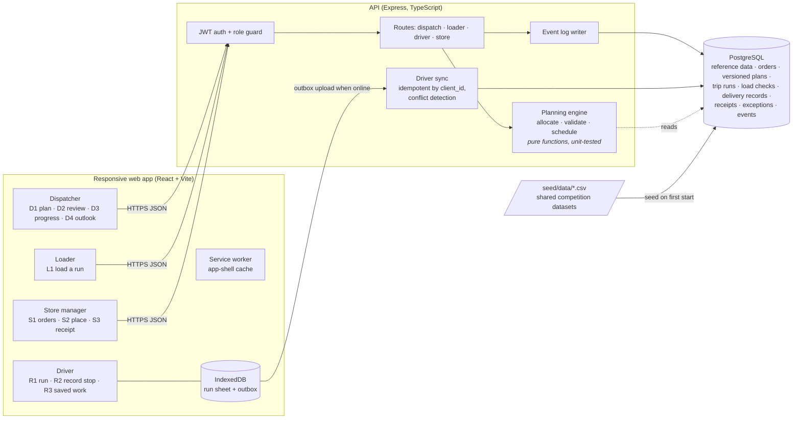

# Architecture

Waypoint Relay is one deployable unit: a Node.js (TypeScript) API that also serves the React web app, backed by PostgreSQL. Every role uses the same responsive web app; the driver and loader views are designed for phones and shared tablets.

## Main components

| Component | Responsibility |
|---|---|
| `apps/server/src/planner` | The planning engine. `allocate.ts` builds a plan with a documented priority policy; `validate.ts` checks every operating constraint; `schedule.ts` builds the operational timetable (early arrival waits for the window, return and reload before trip 2). No I/O, so it is tested directly against Scenario S1. |
| `apps/server/src/services` | Loads planning inputs from the database, saves versioned plan drafts, computes plan diffs for review, builds the published view (ETAs per order). |
| `apps/server/src/routes` | Role-scoped HTTP API. Every state change appends to `events`, the activity record all roles read. |
| `apps/server/src/seed` | Applies `schema.sql` and seeds the shared datasets, four accounts and the S1 delivery day. Idempotent; runs on every start. |
| `apps/web` | React SPA. `lib/outbox.ts` implements the driver's offline outbox in IndexedDB; `public/sw.js` caches the app shell so the driver view opens without signal. |

## Planning and allocation

1. **Eligibility:** available (not in workshop), home depot, refrigeration for chilled goods, vans for van-only outlets, an order that fits a vehicle on its own.
2. **Priority:** outlets skipped on the previous run, then days since last served, then chilled before ambient, then Fresh (opening deadline), then orders with fewer compatible vehicles.
3. **Placement:** join an existing trip of the same brand and district (best fit, avoid wasting refrigerated or van capacity), otherwise open a new trip on the vehicle sized closest to the remaining group demand.
4. **Every placement is validated** with the same `vehicleViolations` function the publish step uses: weight and volume, one brand and district per trip, at most two trips per vehicle, the booklet's 270 min Fresh and 480 min Style/Tech budgets, weekly fuel remaining, and the operational timetable against each outlet's delivery window.
5. **Unplaced orders are deferred with a reason**: `exceeds_vehicle_capacity` (needs order revision; waiting will not help), `no_compatible_vehicle`, `capacity_shortage`, or `dispatcher_choice` (manual, reason required).

The dispatcher can move any order. The server re-validates, refuses a move that breaks a rule, and explains why. Publishing requires zero violations and creates an immutable plan version; changed trips go back to "To load" and need the loader's acknowledgement again.

On S1 the engine serves 73 of 85 orders with zero violations, and its output passes the organizers' `check_allocation.py` (`npx tsx scripts/export-s1.ts out.csv`).

## Offline and recovery (driver)

- The run sheet is stored in IndexedDB when downloaded. The service worker serves the app shell offline.
- Records (acknowledge, depart, delivery, proof photo) go into an outbox **after** the IndexedDB write resolves, so "Saved on this phone" is only shown once the record is actually stored.
- Upload sends records first and photos separately, so "Delivery uploaded · photo pending" is a real, distinct state.
- Each item has a phone-generated UUID (`client_id`). The server records processed ids (`sync_log`, `delivery_records.client_id`), so retries return `duplicate`, not a second delivery.
- If a delivery was recorded against an outdated plan (for example, the order was deferred after the driver downloaded the run), the server keeps the record, marks it `conflict`, and opens a `sync_conflict` exception for the dispatcher. Facts are never silently overwritten.
- Original device time (`recorded_at`) and server receipt time (`received_at`) are stored separately; the dispatcher sees "last update received", not fake live tracking.

## Deployment

- `docker compose up` builds the app image, starts PostgreSQL 16, waits for its health check, then the app applies the schema and seed.
- Production: Render Docker web service plus Supabase PostgreSQL, seeded once from the competition files. No dataset files are in the repository or the image; `docker compose` mounts them from `seed/data/`.
