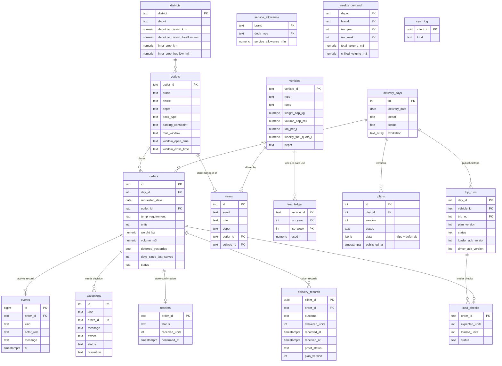

# Data model

The source of truth is `apps/server/src/schema.sql`. The design rule: **what was ordered, what was planned, what physically happened, whether proof reached the office, and what the store confirmed are separate records**, so no single "Delivered" flag hides a gap.

## Notes

- **Plans are versioned documents** (`plans.data` = `{ trips: [{vehicle_id, trip_no, order_ids}], deferred: [{order_id, code, reason}] }`). A published version is never edited; changes create a new draft that must be reviewed and published.
- **Order status** (`confirmed → planned | deferred → loaded → en_route → delivered | partial | failed → received | issue`) is a convenience for lists. The underlying facts live in their own tables and the `events` log.
- **Fuel:** the source data gives weekly quotas, not balances, so `fuel_ledger` records week-to-date use. The planner checks round-trip litres against `quota − used`.
- **weekly_demand** is aggregated from the shared order history: every requested order counted once in its requested ISO week, including deferred and never-run orders. It feeds the D4 capacity outlook.
- **Outlet history contradictions** in S1 (two orders for one outlet with different `deferred_yesterday`) are preserved per order, not merged.
